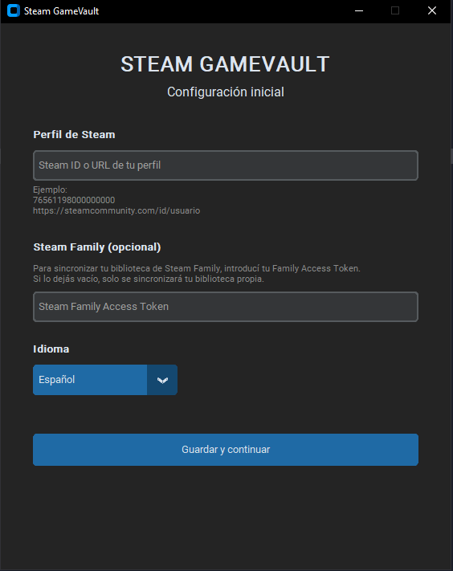
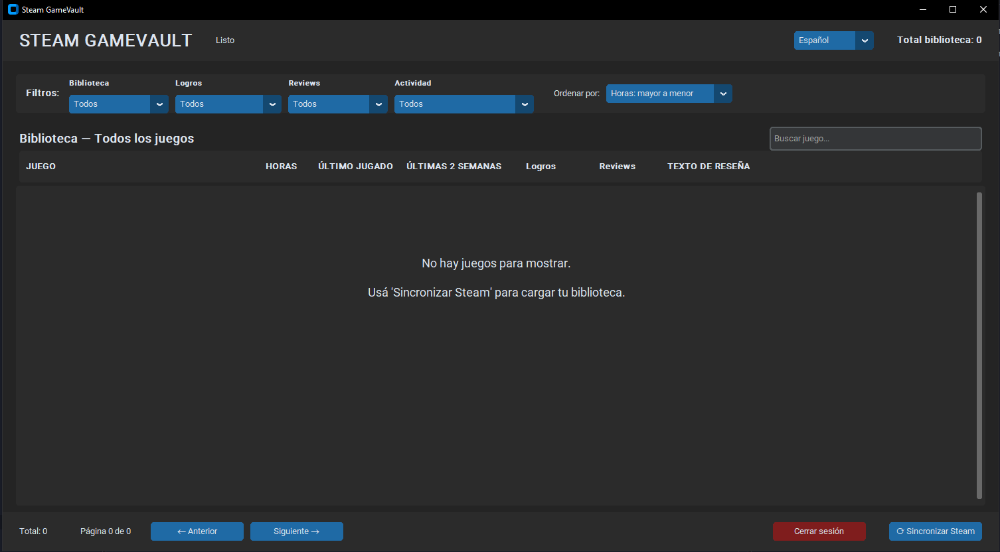
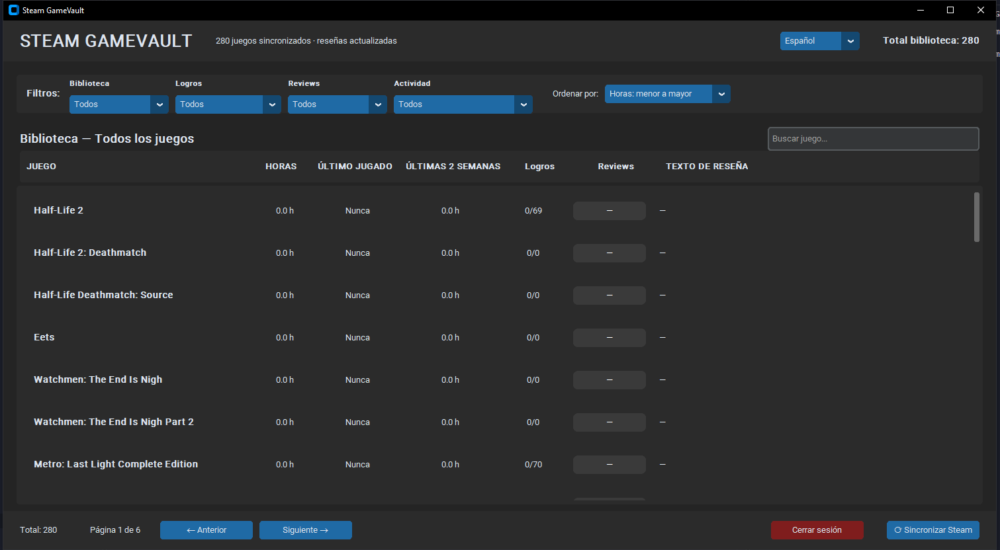

# Steam GameVault

> Una aplicación de escritorio para administrar y visualizar tu biblioteca de Steam en un solo lugar.

Steam GameVault es una aplicación de escritorio para Windows desarrollada con Python que sincroniza tu biblioteca de Steam y muestra tus juegos, horas jugadas, logros, actividad reciente y reseñas de Steam mediante una interfaz moderna y sencilla.

También permite utilizar **bibliotecas de Steam Family**, varios idiomas, búsqueda, filtros, ordenamiento y paginación.

**Idiomas:** [English](README.md) · [Español](README.es.md)

---

## 📸 Capturas de pantalla

### Configuración inicial



### Biblioteca vacía



### Biblioteca de Steam



---

## ✨ Características

- 🎮 **Sincronización de la biblioteca de Steam**
- 👨‍👩‍👧‍👦 **Soporte para Steam Family**
- ⏱️ Horas totales jugadas
- 🕒 Última vez jugado
- 📅 Horas jugadas durante las últimas 2 semanas
- 🏆 Progreso de logros
- ⭐ Estado de reseñas de Steam
- 📝 Texto de las reseñas de Steam
- 🔎 Búsqueda de juegos
- 🎛️ Filtros de biblioteca, logros, reseñas y actividad
- ↕️ Varias opciones de ordenamiento
- 📄 Paginación para bibliotecas grandes
- 🌎 Interfaz en español, inglés y portugués
- 💾 Base de datos SQLite local
- 🔐 La Steam API Key se mantiene en el backend
- 🖥️ Ejecutable para Windows disponible mediante GitHub Releases

---

## 🖥️ Interfaz

La aplicación está diseñada para mostrar una gran biblioteca de Steam de forma compacta, sin necesidad de abrir Steam para consultar cada dato.

La biblioteca principal muestra:

| Columna | Descripción |
|---|---|
| **Juego** | Nombre del juego en Steam |
| **Horas** | Tiempo total jugado |
| **Último jugado** | Última sesión registrada |
| **Últimas 2 semanas** | Tiempo jugado recientemente |
| **Logros** | Logros desbloqueados / totales |
| **Reviews** | Estado de la reseña |
| **Texto de reseña** | Reseña publicada por el usuario |

---

## 🔄 Cómo funciona la sincronización

Steam GameVault utiliza un pequeño backend para realizar las consultas a Steam, manteniendo la Steam API Key del desarrollador fuera de la aplicación de escritorio.

```text
┌──────────────────────┐
│ Steam GameVault      │
│ Aplicación Windows   │
└──────────┬───────────┘
           │
           ▼
┌──────────────────────┐
│ Backend FastAPI      │
│                      │
│ Steam API key        │
│ almacenada en        │
│ el servidor          │
└──────────┬───────────┘
           │
           ▼
┌──────────────────────┐
│ Servicios de Steam   │
│ Web API / Community  │
└──────────────────────┘
```

Los datos sincronizados se almacenan localmente en una base de datos SQLite.

El acceso a Steam Family utiliza el Family Access Token del propio usuario. Este token se almacena localmente y no debe publicarse ni subirse al repositorio.

---

## 🚀 Descargar

La forma recomendada para usuarios normales es descargar Steam GameVault desde **GitHub Releases**.

**[Descargar la última versión para Windows](../../releases/latest)**

Al utilizar el ejecutable compilado no es necesario instalar Python.

> Actualmente la aplicación se distribuye como un ejecutable `.exe` para Windows.

---

## ⚙️ Instalación desde el código fuente

### Requisitos

- Windows
- Python 3.10+
- Una cuenta de Steam
- Git (opcional, para clonar el repositorio)

### 1. Clonar el repositorio

```bash
git clone https://github.com/YOUR-USERNAME/SteamGameVault.git
cd SteamGameVault
```

### 2. Instalar las dependencias

```bash
pip install -r requirements.txt
```

### 3. Configurar las variables de entorno

Crear un archivo `.env` para la configuración del backend.

Ejemplo:

```env
STEAM_API_KEY=tu_steam_api_key
```

**Nunca subas el archivo `.env` real a GitHub.**

### 4. Iniciar el backend

```bash
uvicorn backend.main:app --reload
```

### 5. Iniciar la aplicación

En otra terminal:

```bash
python app/main.py
```

---

## 🔐 Seguridad

Steam GameVault está diseñado para que la Steam Web API Key sea utilizada por el backend y no quede integrada directamente dentro de la aplicación de escritorio.

Los archivos de configuración sensibles nunca deben subirse al repositorio.

Deben mantenerse privados:

- `.env`
- Steam API Keys
- Steam Family Access Tokens
- Bases de datos locales que contengan datos personales

El repositorio debe contener únicamente configuraciones de ejemplo seguras, como `.env.example`.

---

## 🧰 Tecnologías utilizadas

| Tecnología | Uso |
|---|---|
| **Python** | Lenguaje principal |
| **CustomTkinter** | Interfaz gráfica de escritorio |
| **FastAPI** | API backend |
| **SQLite** | Almacenamiento local |
| **Requests** | Comunicación HTTP |
| **BeautifulSoup** | Procesamiento de páginas de Steam |
| **python-dotenv** | Configuración mediante variables de entorno |
| **PyInstaller** | Creación del ejecutable de Windows |

---

## 📁 Estructura del proyecto

```text
SteamGameVault/
├── app/
│   ├── main.py
│   ├── models/
│   ├── services/
│   ├── localization/
│   └── ui/
│
├── backend/
│   ├── main.py
│   └── steam_service.py
│
├── data/
│   └── gamevault.db
│
├── requirements.txt
├── .env.example
├── .gitignore
└── SteamGameVault.spec
```

---

## 🌎 Idiomas

Actualmente la aplicación soporta:

- 🇪🇸 Español
- 🇬🇧 English
- 🇧🇷 Português

El idioma seleccionado se guarda localmente y se restaura al volver a abrir la aplicación.

---

## 🛠️ Crear el ejecutable de Windows

El proyecto puede empaquetarse utilizando PyInstaller:

```powershell
python -m PyInstaller --onefile --windowed --name SteamGameVault app/main.py
```

El ejecutable se generará en:

```text
dist/SteamGameVault.exe
```

La carpeta `dist/` no debería subirse al repositorio principal. Los ejecutables finales pueden publicarse directamente mediante GitHub Releases.

---

## 📌 Estado del proyecto

Steam GameVault es un proyecto en desarrollo activo.

Actualmente incluye:

- Sincronización de biblioteca de Steam
- Sincronización de Steam Family
- Logros
- Reviews
- Estadísticas de horas jugadas
- Búsqueda y filtros
- Ordenamiento
- Paginación
- Interfaz multidioma
- Persistencia local de datos
- Generación de ejecutable para Windows

---

## 🗺️ Próximas mejoras

Algunas mejoras previstas:

- Renovación automática del Family Token
- Estadísticas y gráficos más detallados
- Información adicional de los juegos y portadas
- Mejoras en el sistema de caché de sincronización
- Más información proporcionada por Steam
- Actualizaciones automáticas de la aplicación
- Creación de instalador
- Más idiomas

---

## 🤝 Contribuciones

Las contribuciones, reportes de errores y sugerencias son bienvenidos.

Si encontrás un problema, abrí un issue incluyendo:

1. Descripción clara del problema
2. Pasos para reproducirlo
3. Comportamiento esperado
4. Comportamiento observado
5. Capturas o logs relevantes, si corresponde

---

## 📄 Licencia

Agregá aquí la licencia del proyecto antes de publicar el repositorio.

---

**Steam GameVault**  
Una aplicación personal para administrar bibliotecas de Steam desarrollada con Python.
